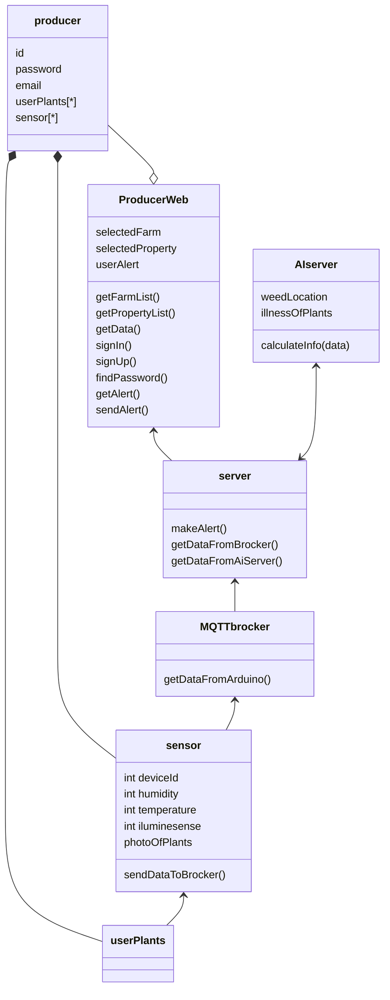

# Class Diagram

```mermaid
classDiagram 
    producer --o ProducerWeb
    producer *--userPlants
    producer *--sensor
    ProducerWeb <-- server
    MQTTbrocker <-- sensor
    server<-- MQTTbrocker
    AIserver <--> server

    sensor <-- userPlants
    class userPlants { }
    class sensor {
        int deviceId
        int humidity
        int temperature
        int iluminesense
        photoOfPlants

        sendDataToBrocker()
    }

    class MQTTbrocker {
        getDataFromArduino()
    }
    class server {
        makeAlert()
        getDataFromBrocker()
        getDataFromAiServer()
    }
    class AIserver {
        weedLocation
        illnessOfPlants

        calculateInfo(data)
    }
    class ProducerWeb{
        selectedFarm
        selectedProperty
        userAlert
        getFarmList()
        getPropertyList()
        getData()
        signIn()
        signUp()
        findPassword()
        getAlert()
        sendAlert()
    }
    class producer {
        id
        password
        email
        userPlants[*]
        sensor[*]
    }

```
